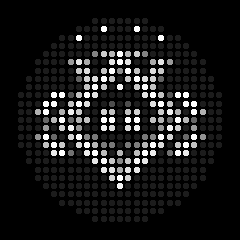
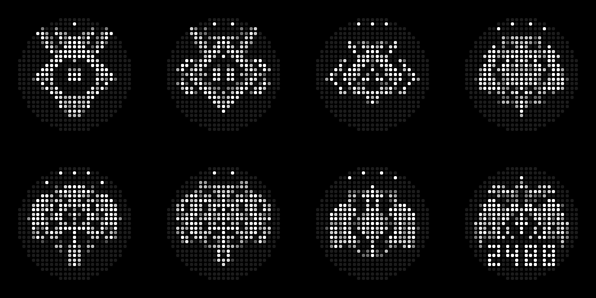
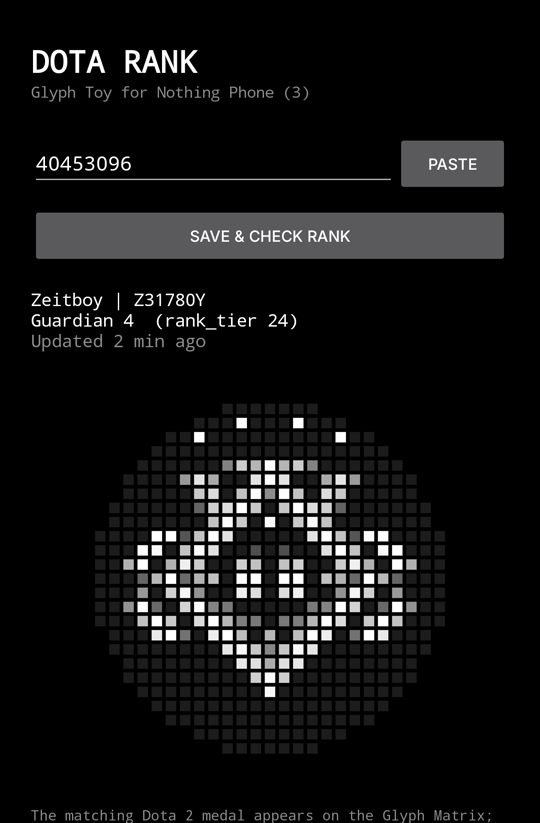
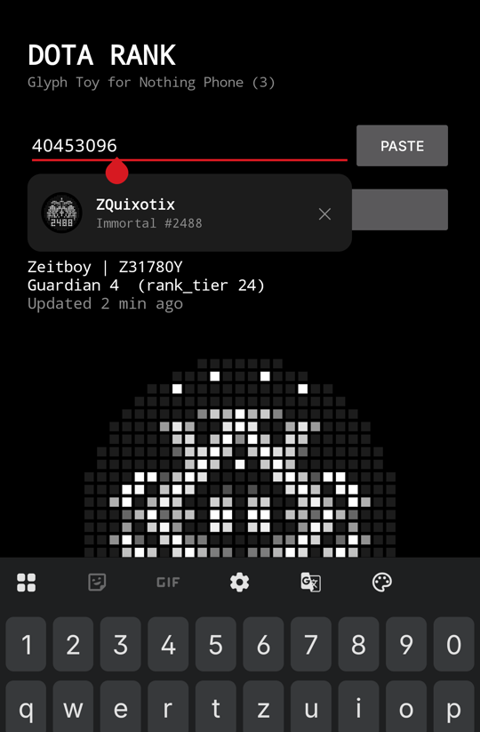
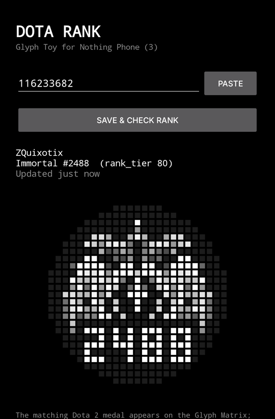
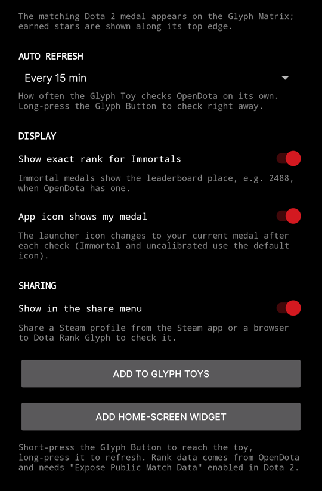

# Dota Rank Glyph

Your Dota 2 rank on the Glyph Matrix of the **Nothing Phone (3)**.

  

Dota Rank Glyph is a Glyph Toy: pick it with the Glyph Button and the back of your phone shows your current Dota 2
medal, with your stars, or your leaderboard place if you are Immortal. Ranks come from the public
[OpenDota](https://www.opendota.com) API. No login, no Steam password, no API key.

Herald 1, Guardian 2, Crusader 3, Archon 4, Legend 5, Ancient 2, Divine 4, Immortal #2488

## Features

### On the Glyph Matrix

- All eight Dota 2 medals, with the earned stars along the top edge.
- Immortal players see their leaderboard place (e.g. `2488`) on the medal. Can be turned off.
- **Long-press** the Glyph Button to check for a new rank right away. The medal shakes while it loads.
- **Rank changes are animated**: a new star fades in and blinks, a new medal gets a wave of light and sparkles.
  If your rank changed while another toy was showing, the animation plays the next time you pick Dota Rank.
- Refreshes on its own every 5 minutes to once a day (you choose).

### In the app

- Enter your account in almost any form: friend ID, Steam profile link, SteamID, Steam friend code link,
  or an OpenDota / Dotabuff / Stratz link.
- **Share** a Steam profile from the Steam app or your browser straight to the app.
- **Recent accounts** drop down when you tap the input field; tap to switch, swipe or ✕ to remove.
- **Home-screen widget** with your medal and rank.
- Optional: the **app icon shows your medal**.
- Clear help when OpenDota can't see your profile.

## Screenshots

| Your rank | Recent accounts | Immortal | Settings |
| :-: | :-: | :-: | :-: |
|  |  |  |  |

## What you need

- A **Nothing Phone (3)**. Other phones have no Glyph Matrix.
- **"Expose Public Match Data"** turned on in Dota 2. Without it OpenDota can't see your rank (see below).
- An internet connection.

## Install

There is no download or store listing yet. For now the app has to be built from source; the steps are in
[CONTRIBUTING.md](CONTRIBUTING.md#build-and-install).

## Getting started

1. Open **Dota Rank Glyph** and enter your account: your Dota friend ID (e.g. `40453096`) or your Steam profile
   link. Or tap **Paste**, or share your profile from the Steam app. Then tap **Save & check rank**.
2. Tap **Add to Glyph Toys** and move **Dota Rank** to the active toys
   (or go to Settings → Glyph Interface → Glyph Toys).
3. Short-press the Glyph Button until your medal appears. Long-press it to refresh.

Optional: tap **Add home-screen widget**, and pick Dota Rank as the Always-on Glyph Toy (experimental).

### What the Glyph shows

| Glyph | Meaning |
| --- | --- |
| Your medal | Your last known rank. It stays up even if a refresh fails. |
| Medal shaking | Checking OpenDota for a new rank. |
| Spinning ring | Loading the first rank for a new account. |
| `ID` | No account set yet; open the app. |
| `?` | OpenDota has no rank for this account (not calibrated, or match data is private). |

Errors are never shown on the Glyph, only in the app.

## Settings

- **Auto refresh**: how often the toy and the widget check for a new rank (every 5 minutes to once a day).
  Long-pressing the Glyph Button or tapping **Save & check rank** always checks right away.
- **Show exact rank for Immortals** (on): the leaderboard place on the Immortal medal.
- **App icon shows my medal** (off): the launcher icon becomes your medal (Herald to Divine).
- **Show in the share menu** (on): lets you share Steam profiles to the app.

## Troubleshooting

### "OpenDota can't see this profile" or no rank

OpenDota only knows your rank if your match data is public:

1. Start Dota 2 and open **Settings** (top left).
2. Go to the **Social** tab and turn on **Expose Public Match Data**.
3. Play a match. OpenDota only sees matches played after the switch is on, a few minutes after each match ends.
4. Check again in the app.

### My rank is out of date

The app shows what OpenDota reports; OpenDota can take a while to pick up a new rank after a match.
Long-press the Glyph Button or tap *Save & check rank* to check again.

### "OpenDota rate limit" or "daily limit"

OpenDota allows 60 requests per minute and 3000 per day for everyone sharing your internet connection.
The app backs off by itself and tries again when OpenDota's limit resets.

### A Steam profile link doesn't work

Links like `steamcommunity.com/id/yourname` need one lookup on Steam, which sometimes limits requests.
Try again in a few minutes, or enter your friend ID instead.

## Privacy

- The app sends your account ID to OpenDota (`api.opendota.com`) to get your rank.
- Custom Steam profile links (`steamcommunity.com/id/…`) are looked up once on `steamcommunity.com`.
- The clipboard is only read when you tap **Paste**.
- No accounts, no analytics, no ads. Everything else stays on your phone.

## Contributing

Bug reports and pull requests are welcome. See [CONTRIBUTING.md](CONTRIBUTING.md) for building, testing and how
the app works inside, and [roadmap.md](roadmap.md) for what's planned.

## License

The source code is under the [MIT License](LICENSE).

Dota 2 and its rank medals are trademarks and property of Valve Corporation. The medal pixel art in this app is based
on their designs and is not covered by the MIT license. Nothing and Glyph are trademarks of Nothing Technology
Limited. This is an unofficial fan project, not affiliated with or endorsed by Valve or Nothing.
Rank data: [OpenDota](https://www.opendota.com).
