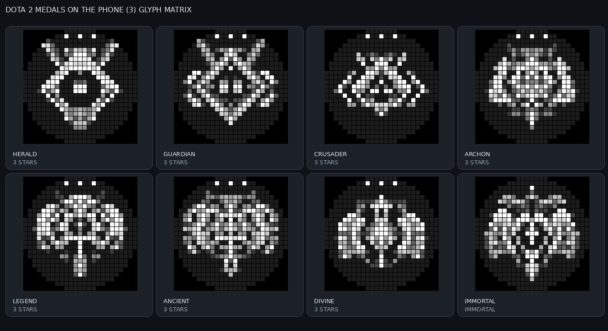

# Dota Rank Glyph

A Glyph Toy for the **Nothing Phone (3)** that shows your Dota 2 rank on the Glyph Matrix, using the OpenDota API.

## Medal display

- The eight grayscale Dota 2 medal images are bundled in the app (`assets/dota_rank_medals.json`).
- Earned stars appear as small bright LEDs along the top of Herald through Divine medals.
- **Show exact rank for Immortals** (on by default): the Immortal medal shows the leaderboard place (e.g. `2488`)
  on a dark plate in its lower part, when OpenDota returns one. Up to 5 digits fit.
- **Status:** `?` uncalibrated, `ID` no account set, spinner = loading the first rank.
  Reloading a known rank shakes the medal instead (always at least one full shake).
- **Errors** are only shown in the app. The Glyph (and the app preview) keep showing the last known medal.

`rank_tier` decoding: tens digit = medal, ones digit = stars. Example: `24` → Guardian, 4 stars.

## Setup

1. **Get the SDK.** Download `glyph-matrix-sdk-2.0.aar` from
   [GlyphMatrix-Developer-Kit](https://github.com/Nothing-Developer-Programme/GlyphMatrix-Developer-Kit)
   into `app/libs/`. It's not bundled because Nothing's licence forbids redistribution.
2. **Open in Android Studio**, let Gradle sync, connect your Phone (3) with USB debugging, press Run.
3. **In the app:** enter your friend ID (e.g. `40453096`), tap *Save & check rank*. The preview shows the Dota medal and stars that will appear on the matrix.
4. **Activate the toy:** tap *Add to Glyph Toys* (or Settings → Glyph Interface → Glyph Toys) and drag *Dota Rank* to Active.
5. **Use it:** short-press the Glyph Button until the toy appears; long-press to refresh.
   Optionally pick it as the Always-on Glyph Toy.

After the first successful check, the app offers once to add the toy (unless the toy has already been on the Glyph).

In the app:
- **Paste** fills the field from the clipboard (read only when you tap it) and shortens links to the ID.
- **Share** a Steam profile from the Steam app or a browser to *Check Dota rank*: the link (also inside a longer
  text) is filled in and checked. Turn off **Show in the share menu** to remove the app from the share sheet.
- **Recent** lists the last 5 checked accounts: tap to switch, long-press to remove.
- The status shows when the rank was last updated, and the last error in red if the latest check failed.

In Dota 2, *Expose Public Match Data* must be enabled, otherwise OpenDota has no rank for you.

### Accepted input

Decoded on the phone, no network needed:
friend ID (`40453096`), SteamID64 (`76561198000718824`), `STEAM_0:0:20226548`, `[U:1:40453096]`,
`steamcommunity.com/profiles/<id64>`, `opendota.com` / `dotabuff.com` / `stratz.com` `/players/<id>` links, and
Steam friend-code links (`s.team/p/djn-gfvm`, quick-invite links with a token, `steamcommunity.com/user/djn-gfvm`).

Custom profile URLs (`steamcommunity.com/id/<name>`) are looked up once, when you save them, through the profile's
public XML view (`/id/<name>/?xml=1`, falling back to the profile page); no Steam Web API key is needed. The account ID
is then stored, so Steam isn't asked again. Steam throttles anonymous lookups without documenting the limits; if it
answers 429, the app says so and doesn't retry.

## Behaviour

- Cached rank is shown instantly; background refresh when it is older than the **Auto refresh** setting
  (every 5 min … once a day, default 30 min).
- Long-press forces a refresh; the medal shakes while it loads. If it fails, the last known medal simply stays.
  If no request is allowed right now (just checked, rate limited), the medal shakes once.
- Reloads started on the Glyph (long-press) or in the app (*Save & check rank*) shake the medal on both
  the Glyph and the open settings screen, in step.
- *Save & check rank* has a 5 s cooldown (and stays disabled while a lookup runs).
- As the AOD toy it redraws on the system's per-minute `EVENT_AOD` tick, but only calls OpenDota when the
  cached rank is older than the Auto refresh setting.
- Changing the ID in the app updates a visible toy immediately, with a single request.
- All requests (app and toy) go through one `RankRepository`: one request per account at a time, min. 5 s apart.

### OpenDota rate limits

The free tier allows 60 requests/minute and 3000/day **per IP address**, reset at the start of each UTC minute and at
00:00 UTC; rejected requests count too. `RefreshPolicy` keeps the app inside that:
- After a 429 (or when the `X-Rate-Limit-Remaining-*` headers reach 0) no request is sent, manual or automatic, until
  the next UTC minute, or until 00:00 UTC for the daily limit. The app shows when it will check again.
- With fewer than 50 requests left today, automatic refreshes pause until 00:00 UTC; manual checks still work.
- After failures (no connection, server errors, private profile) automatic refreshes back off 1, 2, 4, 8 … min,
  never longer than the Auto refresh interval.
The state is stored with the settings, so it survives restarts.

## Things worth knowing about SDK 2.0

- **Raw frame values go up to 4095**, not 255: the SDK's own bitmap converter scales to 0–4095.
  Nothing's example project writes 255, which is very dim.
- The matrix has **489 LEDs** in a circle inside the 25×25 array (row widths from Nothing's LED allocation diagram).
- `GlyphMatrixManager.setGlyphMatrixTimeout(boolean)` exists but is undocumented. It may relate to the matrix
  switching off after a few minutes. It's behind `DISABLE_SYSTEM_TIMEOUT` (off) in `DotaRankToyService`.

## Project layout

| Path | What |
|---|---|
| `rank/Rank.kt` | `rank_tier` → `RankState` (medal + stars / Immortal / uncalibrated) |
| `rank/PlayerInput.kt` | Parses IDs and profile URLs into an account ID |
| `data/SteamProfileResolver.kt` | Looks up custom Steam URLs (`/id/<name>`) without an API key |
| `data/OpenDotaClient.kt` | `GET /api/players/{id}` + JSON parsing + rate-limit headers |
| `data/RankRepository.kt` | The one place that fetches ranks, for the app and the toy |
| `data/RefreshPolicy.kt` | When a request may be sent: rate limits, backoff, refresh interval |
| `data/RankStore.kt` | Account ID, cached rank, last error, settings (SharedPreferences) |
| `data/RecentAccounts.kt` | The recent accounts list |
| `data/RefreshInterval.kt` | Auto refresh interval limits (5 min … once a day) |
| `glyph/` | Matrix geometry, 3×5 font, medal renderer, medal art parser, shared reload shake |
| `app/src/main/assets/dota_rank_medals.json` | Bundled grayscale medal images used by default |
| `data/BundledMedals.kt` | Loads the bundled medal art |
| `toy/GlyphMatrixService.kt` | Toy base class, adapted from Nothing's MIT example |
| `toy/DotaRankToyService.kt` | The toy |
| `ui/` | Settings screen + on-screen matrix preview |

No AndroidX or Compose: the only dependency is the Glyph SDK, so the build stays small.

## Tests

`./gradlew test` runs 87 unit tests: rank decoding, ID parsing, OpenDota parsing (using a real captured response),
the OpenDota client and the Steam custom-URL lookup against a local mock server (captured player responses in `app/src/test/resources/opendota/`;
404, minute/daily 429, rate-limit headers, 5xx, HTML/truncated bodies, timeouts, no connection, non-Latin names),
the refresh policy (429 blocks until the UTC reset, low-quota pause, backoff, 5 s gap), shared-text parsing,
the recent accounts list, auto refresh interval limits,
matrix geometry, renderer checks (lit arcs = tier, one cross per star, nothing drawn outside the LED circle),
the Immortal leaderboard plate, and the medal art (JSON parsing, masking, all 8 bundled medals present,
one clean star pip per star on every bundled medal).

## Next steps

See [roadmap.md](roadmap.md).

## Credits

Rank data: [OpenDota](https://www.opendota.com). Dota 2 is a trademark of Valve Corporation; this project is not affiliated with Valve or Nothing.
The bundled grayscale icons are adapted from the reference screenshots supplied for this project; they are not official Valve image files.
